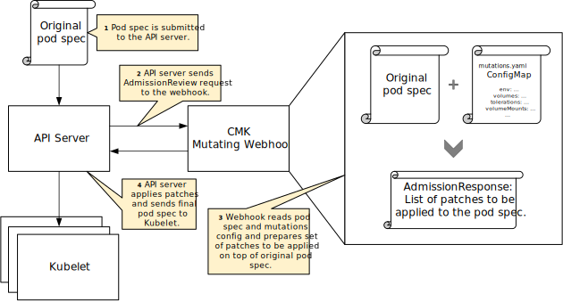

# Architecture: CPU Manager for Kubernetes

## Overview

CMK accomplishes core isolation by controlling what logical CPUs each
container may use for execution by wrapping target application commands
with the CMK command-line program. The `cmk` wrapper program maintains
state in a directory hierarchy on disk that describes **pools** from
which user containers can acquire available **CPU lists**. These pools
can be exclusive (only one container per CPU list) or non-exclusive
(multiple containers can share a CPU list.) Each CPU list directory
contains a `tasks` file that tracks process IDs of the container
subcommand(s) that acquired the CPU list. When the child process exits,
the `cmk` wrapper program clears its PID from the tasks file. If the
wrapper program is killed before it can perform this cleanup step, a
separate periodic reconciliation program detects this condition and cleans
the tasks file accordingly. A file system lock guards against conflicting
concurrent modifications.

The rest of this document discusses the high-level design of CMK.

For more information about the structure of state on disk, see
[The kcm configuration directory][doc-config].

For more information about how to use the `cmk` wrapper program, see
[Using the kcm command-line tool][doc-cli].

For more information about how to configure your cluster for CMK, see the
[Operator manual][doc-operator].

For more information about how to run your workload on a Kubernetes
cluster already configured for CMK, see the
[User manual][doc-user].

## Assumptions

1. The workload is a medium- to long-lived process with inter-arrival
   times on the order of ones to tens of seconds or greater.

1. After a workload has started executing, there is no need to
   dynamically update its CPU assignments.

1. Machines running workloads explicitly isolated by `cmk` must be guarded
   against other workloads that _do not_ consult the `cmk` tool chain.
   The recommended way to do this is for the operator to taint the node.
   The provided cluster-init subcommand automatically adds such a taint.

1. CMK does not need to perform additional tuning with respect to IRQ
   affinity, CFS settings or process scheduling classes.

1. The preferred mode of deploying additional infrastructure components
   is to run them in containers on top of Kubernetes.

## Requirements

1. Provide exclusive access to one or more physical cores for a given
   user containers.

1. Provide shared access to pools of physical cores for groups of
   user containers.

1. Provide a form of cooperative thread-level CPU affinity: allow some
   of a container's threads to run in the infrasctructure pool while
   other high priority threads (e.g. userspace poll-mode driver) run on
   exclusively allocated cores.

1. Run on unmodified Kubernetes releases.  
   **Supported Kubernetes versions:** v1.5.x, v1.6.x

1. Allow the `cmk` tools to be mounted from the host filesystem
   so that users do not need to include the tools inside every user
   container.

1. Interoperate well with the `isolcpus` kernel parameter. When
   initializing the CMK configuration directory, prefer to align
   exclusive CPU lists with fully-isolated physical cores.

1. Provide sufficient observability tooling to quickly assess the
   current configuration and health status of the CMK system.

## High level processes

### Initialization

### Discovery

### Isolation

### Monitoring

Please refer to the [`cmk node-report` documentation][cmk-node-report].

### Reconciliation

Please refer to the [`cmk reconcile` documentation][cmk-reconcile].

## Mutating webhook (Kubernetes v1.9.0+)

CMK makes use of mutating admission webhook to simplify deployment of workloads.

Whenever a user tries to create a pod which definition contains any container
requesting CMK Extended Resources or has `cmk.intel.com/mutate: "true"`
annotation, CMK webhook modifies it by applying a number of modifications on
top of the original pod spec, including:
- CMK installation and configuration directories and host /proc filesystem
  volumes,
- CMK service account,
- tolerations required for the pod to be scheduled on the CMK enabled node,
- annotation to mark pod as modified.

Containers which are part of the pod specification are updated with:
- environmental variable `CMK_NUM_CORES` with its value set to the number of
  cores  specified in the Extended Resource request/limit (if present),
- volume mounts (referencing volumes added to the pod),
- environmental variable `CMK_PROC_FS`.

Complete webhook deployment consists of the following Kubernetes resources:
- Deployment: runs a single instance of mutating webhook server application. It
  ensures that at least 1 instance of webhook is always running - in case of
  node failure webhook application pod gets rescheduled to another node in the
  same cluster. Running the webhook server in deployment also guarantees that
  app will start automatically after single-cluster node reboot and Kubelet or
  container runtime service restart.
- Service: exposes mutating webhook server application to the external world,
  making it visible for Kubernetes API server.
- ConfigMap: defines a file containing a webhook application configuration.
  Webhook reads it on each admission review request, which makes the config file
  configurable during runtime.
- Secret: contains TLS certificate and private key which are used to secure
  communication between the API server and the webhook application.
- Mutating Admission Controller configuration: enable the API server to send
  admission review request to the webhook whenever user requests pod to be
  created. Admission controller configuration points to the service endpoint, it
  also specifies TLS certificate used for authorization, RBAC rules and defines
  failure policy. Default failure policy is set to "Ignore", so in case of
  malfunctioning webhook server spinning up new pods and setting CMK binary and
  config volume mounts is still possible.

All of the above resources are created automatically during cluster init,
although they may be also deployed manually using template specification files
located in `resources/webhook` directory. Manual deployment requires a properly
signed TLS certificate and private key pair to be created and encoded into
base64 format beforehand. Creating and configuring TLS certificates is out of
the scope of this document.

The diagram below shows a high-level overview of the mutating webhook mechanism
in CMK.

For more information and configuration details please refer, to the
[`cmk webhook` documentation][cmk-webhook].

## Known issues

| Issue                      | Description                                    |
| :------------------------- | :--------------------------------------------- |
| Potential race between scheduler and pool state. | If a pod that consumes an exclusive opaque integer resource crashes in a way that prevents the `isolate` launcher from releasing the assigned cores, then although the OIR becomes available, the next invocation of `isolate` may not be able to safely make an allocation. This could occur for a number of reasons, most likely among them are: child process fails to terminate within the allowed grace period after receiving the TERM signal (Kubelet follows up with KILL) or receiving KILL from the kernel OOM (out-of-memory) killer. In this case, `isolate` must crash with a nonzero exit status. This will appear to the operator as a failed pod launch, and the scheduler will try to reschedule the pod. This condition will persist on that node until `reconcile` runs, at which point it will observe that the container's PID is invalid and free the cores for reuse by updating the `tasks` file. |
| Potential conflict with kernel PID reuse. | This should be extremely rare in practice, but it relates to the above scenario. If a PID of a `cmk` subcommand leaks as described above and is recycled by the kernel before `reconcile` runs, then when `reconcile` does run, it will see that the PID refers to a running process and will not remove that PID from the `tasks` file. There is currently no mitigation in place to protect against this scenario. |
| CMK `init` flag values for `--num-shared-cores` and `--num-exclusive-cores` must be positive integers. | Zero is unsupported by the tool chain. |
| The flag values for `--interval` (used in `cmk reconcile` and `cmk node-report`) must be integers. | Fractional seconds are not supported by the tool chain. |

[cmk-node-report]: cli.md#cmk-node-report
[cmk-reconcile]: cli.md#cmk-reconcile
[cmk-webhook]: cli.md#cmk-webhook
[doc-config]: config.md
[doc-cli]: cli.md
[doc-operator]: operator.md
[doc-user]: user.md
