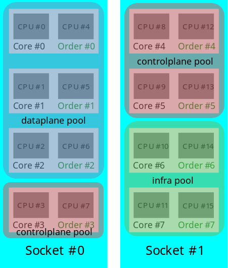
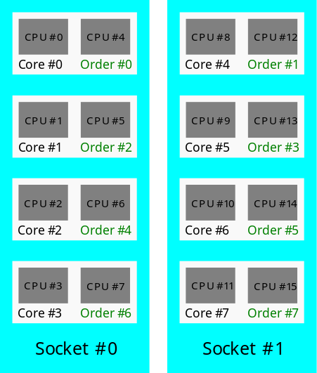

<!--
Copyright (c) 2017 Intel Corporation

Licensed under the Apache License, Version 2.0 (the "License");
you may not use this file except in compliance with the License.
You may obtain a copy of the License at

     http://www.apache.org/licenses/LICENSE-2.0

Unless required by applicable law or agreed to in writing, software
distributed under the License is distributed on an "AS IS" BASIS,
WITHOUT WARRANTIES OR CONDITIONS OF ANY KIND, either express or implied.
See the License for the specific language governing permissions and
limitations under the License.
-->

# CMK operator manual

## Table of Contents
* [System requirements](#system-requirements)
* [Setting up the cluster](#setting-up-the-cluster)
  * [Multi socket support (experimental)](#multi-socket-support-experimental)
* [Running the `cmk isolate` Hello World Pod](#running-the-cmk-isolate-hello-world-pod)
* [Validating the environment](#validating-the-environment)
* [Troubleshooting and recovery](#troubleshooting-and-recovery)

_Related:_

- [Using the cmk command-line tool][doc-cli]

## System requirements.
Kubernetes >= v1.5.0 (excluding v1.8.0, details below)

### Kubernetes preparation
All of template manifests provided with CMK are using serviceaccount which is
defined in [`cmk-serviceaccount`][cmk-serviceaccount] manifest. Before first
CMK run, operator should use it to define `cmk-serviceaccount`. This step isn't
obligatory on Kubernetes 1.5 but it's strongly recomended. Kubernetes 1.6
requires it because of RBAC authorization method which will use it to deliver
API access from inside of CMK pod(s).

#### Kubernetes 1.6
From Kubernetes 1.6 [RBAC][RBAC] has became default authorization method.
Operator needs to prepare additional [ClusterRole][ClusterRole] and
[ClusterRoleBindings][ClusterRoleBindings] in order to deploy CMK.Those are
provided in [`cmk-rbac-rules`][cmk-rbac-rules] manifest. In this case operator
must also use provided serviceaccount manifest as well.

#### Kubernetes 1.7
From Kubernetes 1.7 [Custom Resource Definitions] has replaced [Third Party Resource].
Only in Kubernetes 1.7 both are compatible. Operator must [migrate] from TRP to CRD.
To [`cmk-rbac-rules`][cmk-rbac-rules] manifest ClusterRole and ClusterRoleBindings have been added for CRD.
CMK will detect the version Kubernetes itself and will be use [Custom Resource Definitions]
if Kubernetes version is 1.7 else [Third Party Resource] to create Nodereport and Reconcilereport.

Additionally [Taints][Taints] have been moved from alpha to beta and are no logner present in node `metadata` but directly in `spec`. Please note that if pod manifest has `nodeName: <nodename>` selector, taints tolerations are not needed.

#### Kubernetes 1.8
***Kubernetes 1.8.0 is not supported due to extended resources issue(it's impossible to create extended resource). Use Kubernetes 1.8.1+ instead.***

#### Kubernetes 1.9
From Kubernetes 1.9.0 mutating admission controller is being used to update any pod which
definition contains any container requesting CMK Extended Resources. CMK webhook modifies
it by injecting environmental variable `CMK_NUM_CORES` with its value set to a number of cores
specified in the Extended Resource request. This allows `cmk isolate` to assign multiple
CPU cores to given process.
On top of that webhook applies additional changes to the pod which are defined in
the configuration file. By default, configuration deployed during `cmk cluster-init` adds
CMK installation and configuration directories and host /proc filesystem volumes, CMK
service account, tolerations required for a pod to be scheduled on the CMK enabled node
and appropriately annotates pod. Containers specifications are updated with volume mounts
(referencing volumes added to the pod) and environmental variable `CMK_PROC_FS`.

## Setting up the cluster.
https://kubernetes.io/docs/admin/authorization/rbac/#rolebinding-and-clusterrolebinding
This section describes the setup required to use the `CMK` software.

Notes:
- The recommended way to prepare Kubernetes nodes for the `CMK` software is to run `cmk cluster-init` as a Pod as
described in [cluster setup instructions using `cmk cluster-init`][cluster-init-op-manual].
- The [cluster setup instructions using manually created Pods][indvidual-pods-op-manual] should only be used if and
only if running `cmk cluster-init` fails for some reason.

### TL;DR
Prepare the nodes by running `cmk cluster-init` using these [instructions][cluster-init-op-manual].

### Cluster setup table of contents.
* [Concepts](#concepts)
* [Preparing nodes by running `cmk cluster-init` (recommended)][cluster-init-op-manual]
* [Preparing nodes by running each `CMK` subcommand as a Pod (use only if required)][indvidual-pods-op-manual]

### Concepts

| Term           | Meaning |
| :------------- | :------ |
| `CMK` nodes    | The operator can choose any number of nodes in the kubernetes cluster to work with `CMK`. These participating nodes will be referred as `CMK` nodes. |
| Pod            | A Pod is an abstraction in Kubernetes to represent one or more containers and their configuration. It is the smallest schedulable unit in Kubernetes. |
| OIR            | Acronym for [Opaque Integer Resource][oir-docs]. In Kubernetes, OIR allow cluster operators to advertise new node-level resources that would be otherwise unknown to the system. |
| Volume         | A volume is a directory (on host file system). In Kubernetes, a volume has the same lifetime as the Pod that uses it. Many types of volumes are supported in Kubernetes. |
| `hostPath`       | `hostPath` is a volume type in Kubernetes. It mounts a file or directory from the host file system into the Pod. |

### Prepare `CMK` nodes by running `cmk cluster-init`.
`CMK` nodes can be prepared by using [`cmk cluster-init`][cmk-cluster-init] subcommand. The subcommand is expected to
be run as a pod. The [cmk-cluster-init-pod template][cluster-init-template] can be used to run `cmk cluster-init` on a
Kubernetes cluster. When run on a Kubernetes cluster, the Pod spawns two Pods per node at most in order to prepare
each node.

The only value that requires change in the [cmk-cluster-init-pod template][cmk-cluster-init] is the `args` field,
which can be modified to pass different options.

Following are some example modifications to the `args` field:
```yml
  - args:
      # Change this value to pass different options to cluster-init.
      - "/cmk/cmk.py cluster-init --host-list=node1,node2,node3"
```
The above command prepares nodes "node1", "node2" and "node3" for the `CMK` software using default options.

```yml
  - args:
      # Change this value to pass different options to cluster-init.
      - "/cmk/cmk.py cluster-init --all-hosts"
```
The above command prepares all the nodes in the Kubernetes cluster for the `CMK` software using default options.

```yml
  - args:
      # Change this value to pass different options to cluster-init.
      - "/cmk/cmk.py cluster-init --host-list=node1,node2,node3 --cmk-cmd-list=init,discover"
```
The above command prepares nodes "node1", "node2" and "node3" but only runs the `cmk init` and `cmk discover`
subcommands on each of those nodes.

For more details on the options provided by `cmk cluster-init`, see this [description][cmk-cluster-init].

### Prepare `CMK` nodes by running each `CMK` subcommand as a Pod.

Notes:
- The instructions provided in this section should only be used if and only if running `cmk cluster-init` fails
for some reason.
- The subcommands described below should be run in the same order.
- The documentation in this section assumes that the `CMK` configuration directory is `/etc/cmk` and the `cmk`
binary is installed on the host under `/opt/bin`.
- In all the pod templates used in this section, the name of container image used is `cmk:v1.3.1`. It is expected that the
`cmk` container image is built and cached locally in the host. The `image` field will require modification if the
container image is hosted remotely (e.g., in https://hub.docker.com/).

#### Run `cmk init`
The `CMK` nodes in the kubernetes cluster should be initialized in order to be used with the CMK software using
[`cmk-init`][cmk-init]. To initialize the `CMK` nodes, the [cmk-init-pod template][init-template] can be used.

`cmk init` takes the `--conf-dir`, `--num-exclusive-cores` and the `--num-shared-cores` flags. In the
[cmk-init-pod template][init-template], the values to these flags can be modified. The value for `--conf-dir` can be
set by changing the `path` value of the `hostPath` for the `cmk-conf-dir`. The value for `--num-exclusive-cores` and
`--num-shared-cores` can be set by changing the values for the `NUM_EXCLUSIVE_CORES` and `NUM_SHARED_CORES` environment variables,
respectively.

Values that might require modification in the [cmk-init-pod template][init-template] are shown as snippets below:

```yml
  volumes:
  - hostPath:
      # Change this to modify the CMK config dir in the host file system.
      path: "/etc/cmk"
    name: cmk-conf-dir
```

```yml
    env:
    - name: NUM_EXCLUSIVE_CORES
      # Change this to modify the value passed to `--num-exclusive-cores` flag.
      value: '4'
    - name: NUM_SHARED_CORES
      # Change this to modify the value passed to `--num-shared-cores` flag.
      value: '1'
```

#### Advertising `CMK` Opaque Integer Resource (OIR) slots
All the `CMK` nodes in the Kubernetes cluster should be patched with `CMK` [OIR][oir-docs] slots using
[`cmk discover`][cmk-discover]. The OIR slots are advertised as the exclusive pools need to be allocated exclusively.
The number of slots advertised should be equal to the number of cpu lists under the __exclusive__ pool, as determined
by examining the `CMK` configuration directory. [cmk-discover-pod template][discover-template] can be used to
advertise the `CMK` OIR slots.

`cmk discover` takes the `--conf-dir` flag. In the [cmk-discover-pod template][discover-template], the value for
`--conf-dir` can be configured by changing the `path` value of the `hostPath` for `cmk-conf-dir`. After running
this Pod in a node, the node will be patched with `pod.alpha.kubernetes.io/opaque-int-resource-cmk' OIR.

Values that might require modification in the [cmk-discover-pod template][discover-template] are shown as snippets
below:

```yml
  volumes:
  - hostPath:
      # Change this to modify the CMK config dir in the host file system.
      path: "/etc/cmk"
    name: cmk-conf-dir
```

#### Run `cmk reconcile`
In order to reconcile from an outdated `CMK` configuration state, each `CMK` node should run
[`cmk reconcile`][cmk-reconcile] periodically. `cmk reconcile` can be run periodically using the
[cmk-reconcile-daemonset template][reconcile-template].

In the [cmk-reconcile-daemonset template][reconcile-template], the time between each invocation of `cmk reconcile`
can be adjusted by changing the value of the CMK_RECONCILE_SLEEP_TIME environment variable. The value specifies time
in seconds. `cmk reconcile` takes the `--conf-dir` flag. This value can be configured by changing the `path`
value of the `hostPath` for the `cmk-conf-dir` in the [cmk-reconcile-daemonset][reconcile-template] template.

Values that might require modification in the [cmk-reconcile-daemonset template][reconcile-template] are shown as
snippets below:

```yml
    env:
    - name: CMK_RECONCILE_SLEEP_TIME
        # Change this to modify the sleep interval between consecutive
        # cmk reconcile runs. The value is specified in seconds.
        value: '60'
```

```yml
  volumes:
  - hostPath:
      # Change this to modify the CMK config dir in the host file system.
      path: "/etc/cmk"
    name: cmk-conf-dir
```

#### Run `cmk install`
[`cmk install`][cmk-install] is used to create a zero-dependency binary of the `CMK` software and place it on the host
filesystem. Subsequent containers can isolate themselves by mounting the install directory from the host and then
calling `cmk isolate`. To run it on all the `CMK` nodes, the [cmk-install-pod template][install-template]
can be used.

`cmk install` takes the `--install-dir` flag. In the [cmk-install-pod template][install-template], the value for
`--install-dir` can be configured by changing the `path` value of the `hostPath` for the `cmk-install-dir`.

Values that might require modification in the [cmk-install-pod template][install-template] are shown as snippets
below:

```yml
  volumes:
  - hostPath:
      # Change this to modify the CMK installation dir in the host file system.
      path: "/opt/bin"
    name: cmk-install-dir
```

#### Run `cmk webhook` (Kubernetes v1.9.0+ only)
`cmk webhook` is used to run mutating admission webhook server. Whenever there's a requestto create a new pod,
the webhook can capture that request, check whether any of the containers requests or limits number of the CMK
Extended Resources and update pod and its container specification appropriately. This allows to simplify deployment
of workloads taking advantage of CMK, by reducing the number of requirements to the minimum.

```
...
spec:
  containers:
    resources:
      requests:
        cmk.intel.com/exclusive-cores: 2
...
```

In order to deploy CMK mutating webhook a number of resources needs to be created on
the cluster. But even before that, operator needs to have X509 private key and TLS
certificate in PEM format generated. Certificates can be self-signed, although using
ceritificates signed by proper CA or [Kubernetes Certificates API][k8s-ca] is highly
recommended. After meeting that requirement, steps to deploy webhook are as follows:
1. Certificates in PEM format should be then encoded to Base64 format and
   placed in the [Mutating Admission Configuration][webhook-config-template] and
   [Secret][webhook-secret-template] templates.
2. Update [config map template][webhook-configmap-template]. Config map contains 2
   configuration files `server.yaml` and `mutations.yaml`. Configuration options are
   described in the [cmk command-line tool documentation][doc-cli].
3. Create [secret][webhook-secret-template], [service][webhook-service-template] and
   [config map][webhook-configmap-template] using `kubectl create -f ...` command.
4. Run `cmk webhook` pod defined in the [webhook pod template][webhook-pod-template] using
   `kubectl create -f ...` command.
5. If the `cmk webhook` pod is running correctly, create
   [Mutating Admission Configuration][webhook-config-template] object.

### Multi socket support (experimental)
`CMK` is able to use multiple sockets. During cluster initialization, `init` module will distribute cores from all sockets
across pools. To prevent a situation, where __exclusive__ pool or __shared__ pool are spawned only on a single socket
operator is able to use one of two `mode` policies: `packed` and `spread`. Those policies define how cores are assigned to
specific pool:

- __packed__ mode will put cores in the following order:



_Note: This policy is not topology aware, so there is a possibility that one pool won't spread on multiple sockets._

- __spread__ mode will put following cores order:



_Note: This policy is topology aware, so CMK will try to spread pools on each socket._

To select appropriate `mode` operator can select it during initialization with `--shared-mode` or `--exclusive-mode` parameters.
Those parameters can be used with `cluster-init` and `init`. If operator use two different modes, then those policies
will be mixed. In that case __exclusive__ pool is resolving before __shared__ pool.

## Running the `cmk isolate` Hello World Pod
After following the instructions in the previous section, the cluster is ready to run the `Hello World` Pod. The Hello
World [cmk-isolate-pod template][isolate-template] describes a simple Pod with three containers requesting CPUs from
the __exclusive__, __shared__ and the __infra__ pools, respectively, using [`cmk isolate`][cmk-isolate]. The
`pool` is requested by passing the desired value to the `--pool` flag when using `cmk isolate` as described in the
[documentation][cmk-isolate].

`cmk isolate` can use `--socket-id` flag to target on which socket application should be spawned. This flag is optional,
suitable only for __exclusive__ pool and if it's not used `cmk isolate` will use first not reserved core.

`cmk isolate` also takes the `--conf-dir` and `--install-dir` flags. In the [cmk-isolate-pod template][isolate-template],
the values for `--conf-dir` and `--install-dir` can be modified by changing the `path` values of the `hostPath`.

Values that might require modification in the [cmk-isolate-pod template][isolate-template] are shown as snippets
below:

```yml
  volumes:
  - hostPath:
      # Change this to modify the CMK installation dir in the host file system.
      path: "/opt/bin"
    name: cmk-install-dir
  - hostPath:
      # Change this to modify the CMK config dir in the host file system.
      path: "/etc/cmk"
    name: cmk-conf-dir
```

Notes:
- The Hello World cmk-isolate-pod consumes the `pod.alpha.kubernetes.io/opaque-int-resource-cmk` Opaque Integer
Resource (OIR) only in the container isolated using the __exclusive__ pool. The `CMK` software assumes that only
container isolated using the __exclusive__ pool requests the OIR and each of these containers should consume exactly
one OIR. This restricts the number of pods that can land on a Kubernetes node to the expected value.
- The `cmk isolate` Hello World Pod should only be run after following the instructions provided in the
[`Setting up the cluster`][cluster-setup] section.

## Validating the environment
Following is an example to validate the environment in one node.
- Pick a node to test. For illustration, we will use `<node-name>` as the name of the node.
- Check if node has appropriate label.
```sh
kubectl get node <node-name> -o json | jq .metadata.labels
```
Example output:
```sh
kubectl get node cmk-02-zzwt7w -o json | jq .metadata.labels
{
    "beta.kubernetes.io/arch": "amd64",
    "beta.kubernetes.io/os": "linux",
    "cmk.intel.com/cmk-node": "true",
    "kubernetes.io/hostname": "cmk-02-zzwt7w"
}
```
- Check if node has appropriate taint. **(kubernetes < v1.7)**
```sh
kubectl get node <node-name> -o json | jq .metadata.annotations
```
Example output:
```sh
kubectl get node cmk-02-zzwt7w -o json | jq .metadata.annotations
{
      "scheduler.alpha.kubernetes.io/taints": "[{\"value\": \"true\", \"key\": \"cmk\", \"effect\": \"NoSchedule\"}]",
      "volumes.kubernetes.io/controller-managed-attach-detach": "true"
}
```
- Check if node has appropriate taint. **(kubernetes >= v1.7)**
```sh
kubectl get node <node-name> -o json | jq .spec.taints
```
Example output:
```sh
kubectl get node cmk-02-zzwt7w -o json | jq .spec.taints
[
  {
    "effect": "NoSchedule",
    "key": "cmk",
    "timeAdded": null,
    "value": "true"
  }
]

```
- Check if node has the appropriate OIR. **(kubernetes < v1.8)**
```sh
kubectl get node <node-name> -o json | jq .status.capacity
```
Example output:
```sh
kubectl get node cmk-02-zzwt7w -o json | jq .status.capacity
{
    "alpha.kubernetes.io/nvidia-gpu": "0",
    "cpu": "16",
    "memory": "14778328Ki",
    "pod.alpha.kubernetes.io/opaque-int-resource-cmk": "4",
    "pods": "110"
}
```
- Check if node has the appropriate ER. **(kubernetes >= v1.8.1)**
```sh
kubectl get node <node-name> -o json | jq .status.capacity
```
Example output:
```sh
kubectl get node cmk-02-zzwt7w -o json | jq .status.capacity
{
    "alpha.kubernetes.io/nvidia-gpu": "0",
    "cpu": "16",
    "memory": "14778328Ki",
    "cmk.intel.com/exclusive-cores": "4",
    "pods": "110"
}
```
- Login to the node and check if `CMK` configuration directory and binary exisits. Assuming default options were
used for `cmk cluster-init`, you would do the following:
```sh
ls /etc/cmk/
ls /opt/bin/
```
- Replace the `nodeName` in the Pod manifest below to the chosen node name and save it to a file.
```yml
apiVersion: v1
kind: Pod
metadata:
  labels:
    app: cmk-isolate-pod
  name: cmk-isolate-pod
spec:
  # Change this to the <node-name> you want to test.
  nodeName: NODENAME
  containers:
  - args:
    - "/opt/bin/cmk isolate --conf-dir=/etc/cmk --pool=infra sleep -- 10000"
    command:
    - "/bin/bash"
    - "-c"
    env:
    - name: CMK_PROC_FS
      value: "/host/proc"
    image: cmk:v1.3.1
    imagePullPolicy: "Never"
    name: cmk-isolate-infra
    volumeMounts:
    - mountPath: "/host/proc"
      name: host-proc
      readOnly: true
    - mountPath: "/opt/bin"
      name: cmk-install-dir
    - mountPath: "/etc/cmk"
      name: cmk-conf-dir
  restartPolicy: Never
  volumes:
  - hostPath:
      # Change this to modify the CMK installation dir in the host file system.
      path: "/opt/bin"
    name: cmk-install-dir
  - hostPath:
      path: "/proc"
    name: host-proc
  - hostPath:
      # Change this to modify the CMK config dir in the host file system.
      path: "/etc/cmk"
    name: cmk-conf-dir
```
- Run `kubectl create -f <file-name>`, where `<file-name>` is name of the Pod manifest file with `nodeName` field
substituted as mentioned in the previous step.
- Check if any process is isolated in the `infra` pool using `NodeReport` for that node.
If you using third part resources (kubernetes 1.6.x and older versions)
`kubectl get NodeReport <node-name> -o json | jq .report.description.pools.infra`
If you using custom resources definition (kubernetes 1.7.x and newer versions)
`kubectl get cmk-nodereport <node-name> -o json | jq .spec.report.description.pools.infra`

### Validating CMK mutating webhook (Kubernetes v1.9.0+)

- Follow all the above steps, but use simplified Pod manifest:
```
apiVersion: v1
kind: Pod
metadata:
  labels:
    app: cmk-isolate-pod
  name: cmk-isolate-pod
spec:
  # Change this to the <node-name> you want to test.
  nodeName: NODENAME
  containers:
  - args:
    - "/opt/bin/cmk isolate --conf-dir=/etc/cmk --pool=exclusive sleep -- 10000"
    command:
    - "/bin/bash"
    - "-c"
    env:
    image: cmk:v1.3.1
    imagePullPolicy: "Never"
    name: cmk-isolate-infra
    resources:
      requests:
        cmk.intel.com/exclusive-cores: 1
  restartPolicy: Never
```
- Run `kubectl create -f <file-name>`, where `<file-name>` is the name of the Pod manifest file with nodeName field
substituted as mentioned in the previous section.
- Run `kubectl get pod cmk-isolate-pod  -o json | jq .metadata.annotations` and verify that annotation has been
added:
```
{
  "cmk.intel.com/resources-injected": "true"
}
```
- Run `kubectl get pod cmk-isolate-pod  -o json | jq .spec.volumes` and verify that extra volumes have been
injected:
```
[
  {
    "name": "default-token-xfd8q",
    "secret": {
      "defaultMode": 420,
      "secretName": "default-token-xfd8q"
    }
  },
  {
    "hostPath": {
      "path": "/proc",
      "type": ""
    },
    "name": "cmk-host-proc"
  },
  {
    "hostPath": {
      "path": "/etc/cmk",
      "type": ""
    },
    "name": "cmk-config-dir"
  },
  {
    "hostPath": {
      "path": "/opt/bin",
      "type": ""
    },
    "name": "cmk-install-dir"
  }
]
```
- Run `kubectl get pod cmk-isolate-pod  -o json | jq .spec.containers[0].env` and verify that
env variables have been added to the container spec:
```
[
  {
    "name": "CMK_PROC_FS",
    "value": "/host/proc"
  },
  {
    "name": "CMK_NUM_CORES",
    "value": "1"
  }
]

```


## Troubleshooting and recovery
If running `cmk cluster-init` using the [cmk-cluster-init-pod template][cluster-init-template] ends up in an error,
the recommended way to start troubleshooting is to look at the logs using `kubectl logs POD_NAME [CONTAINER_NAME] -f`.

For example, assuming you ran the [cmk-cluster-init-pod template][cluster-init-template] with default options, it
should create two pods on each node named `cmk-init-install-discover-pod-<node-name>` and
`cmk-reconcile-nodereport-<node-name>`, where `<node-name>` should be replaced with the name of the node.

If you want to look at the logs from the container which ran the `discover` subcommand in the pod, you can use
`kubectl logs -f cmk-init-install-discover-pod-<node-name> discover`

If you want to look at the logs from the container which ran the `reconcile` subcommand in the pod, you can use
`kubectl logs -f cmk-reconcile-nodereport-pod-<node-name> reconcile`

If you want to remove `cmk` use `cmk-uninstall-pod.yaml`. [nodeSelector](https://kubernetes.io/docs/user-guide/node-selection)
can help to fine-grain the deletion for specific node.


[cluster-setup]: #setting-up-the-cluster
[doc-cli]: cli.md
[cmk-init]: cli.md#cmk-init
[cmk-discover]: cli.md#cmk-discover
[cmk-reconcile]: cli.md#cmk-reconcile
[cmk-install]: cli.md#cmk-install
[cmk-isolate]: cli.md#cmk-isolate
[cmk-cluster-init]: cli.md#cmk-cluster-init
[init-template]: ../resources/pods/cmk-init-pod.yaml
[discover-template]: ../resources/pods/cmk-discover-pod.yaml
[reconcile-template]: ../resources/pods/cmk-reconcile-daemonset.yaml
[install-template]: ../resources/pods/cmk-install-pod.yaml
[isolate-template]: ../resources/pods/cmk-isolate-pod.yaml
[cluster-init-template]: ../resources/pods/cmk-cluster-init-pod.yaml
[webhook-pod-template]: ../resources/webhook/cmk-webhook-pod.yaml
[webhook-service-template]: ../resources/webhook/cmk-webhook-service.yaml
[webhook-secret-template]: ../resources/webhook/cmk-webhook-certs.yaml
[webhook-configmap-template]: ../resources/webhook/cmk-webhook-configmap.yaml
[webhook-config-template]: ../resources/webhook/cmk-webhook-config.yaml
[oir-docs]: http://kubernetes.io/docs/user-guide/compute-resources#opaque-integer-resources-alpha-feature
[cluster-init-op-manual]: #prepare-cmk-nodes-by-running-cmk-cluster-init
[indvidual-pods-op-manual]: #prepare-cmk-nodes-by-running-each-cmk-subcommand-as-a-pod
[cmk-serviceaccount]: ../resources/authorization/cmk-serviceaccount.yaml
[RBAC]: https://kubernetes.io/docs/admin/authorization/rbac/
[ClusterRole]: https://kubernetes.io/docs/admin/authorization/rbac/#role-and-clusterrole
[ClusterRoleBindings]: https://kubernetes.io/docs/admin/authorization/rbac/#rolebinding-and-clusterrolebinding
[cmk-rbac-rules]: ../resources/authorization/cmk-rbac-rules.yaml
[Custom Resource Definitions]: https://kubernetes.io/docs/tasks/access-kubernetes-api/extend-api-custom-resource-definitions/
[Third Party Resource]: https://kubernetes.io/docs/tasks/access-kubernetes-api/extend-api-third-party-resource/
[migrate]: https://kubernetes.io/docs/tasks/access-kubernetes-api/migrate-third-party-resource/
[Taints]: https://kubernetes.io/docs/concepts/configuration/taint-and-toleration/
[k8s-ca]: https://kubernetes.io/docs/concepts/cluster-administration/certificates/
