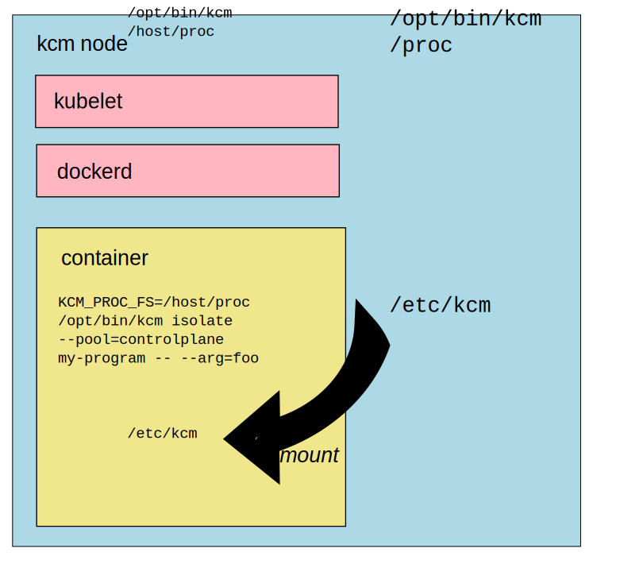

<!--
Copyright (c) 2017 Intel Corporation

Licensed under the Apache License, Version 2.0 (the "License");
you may not use this file except in compliance with the License.
You may obtain a copy of the License at

     http://www.apache.org/licenses/LICENSE-2.0

Unless required by applicable law or agreed to in writing, software
distributed under the License is distributed on an "AS IS" BASIS,
WITHOUT WARRANTIES OR CONDITIONS OF ANY KIND, either express or implied.
See the License for the specific language governing permissions and
limitations under the License.
-->

# `cmk` user manual

This doc is for application owners who need to deploy containers with
core affinity requirements on Kubernetes.

Here we assume that the cluster is already properly configured. For
information on how to set up the cluster with `cmk` enabled, see the
[`cmk` operator manual][doc-operator].

## Pod configuration

The only CMK CLI subcommand users (pod authors) need to know about is
[cmk isolate][cmk-isolate]. The `isolate` subcommand consults shared state
on the host configmap to acquire and bookkeep an assigned subset of CPUs
a command should run on.

By default `cmk isolate` allocates a single CPU core. In order to request
multiple CPU cores, the environmental variable `CMK_NUM_CORES` can be set.
`cmk isolate` consumes its value and based on that allocates a number
of requested CPUs.

**ALERT:** It's easy to accidentally break out of `cmk isolate` with a malformed
shell command in user pod specs. For example:
`cmk isolate echo foo && sleep 100` isolates _only the execution of `echo`_!
The assigned CPUs are wrongly freed early when `cmk` returns. To avoid this
situation, avoid forking in the shell command, or alternately isolate a shell
and wrap your complex command:
`cmk isolate --pool=<pool> /bin/bash -- -c "foo && bar || baz"`



The figure illustrates a few important points:

- The host [procfs][procfs] must be mounted into the container at a path that matches
  the value of the `CMK_PROC_FS` environment variable. Since bind-mounting
  over the top of the procfs at `/proc` from inside the pid namespace would
  cause problems, we mount it at `/host/proc` in the examples throughout these
  docs.
- The operator guide recommends providing the `cmk` binary on the host
  filesystem so it can be mounted and used from user containers without forcing
  them to build `cmk` into their images. By default these docs assume the
  binary is available on the host filesystem at `/opt/bin/cmk`.

For a complete example, see the [cmk isolate pod template][isolate-template].

### Pod configuration on the clusters with CMK mutating webhook (Kubernetes v1.9.0+)

From Kubernetes v1.9.0 additional CMK component, `cmk webhook`, is deployed.
It allows to simplify the above configuration and enables automatic injection
of all requirements mentioned above such as volumes, service accounts, env vars etc.
Minimal working example of a Pod manifest compatible with CMK deployed in this way
is presented below:
```
apiVersion: v1
kind: Pod
metadata:
  labels:
    app: cmk-isolate-pod
  name: cmk-isolate-pod
spec:
  containers:
  - args:
    - "/opt/bin/cmk isolate --pool=exclusive sleep -- 10000"
    command:
    - "/bin/bash"
    - "-c"
    env:
    image: cmk:v1.5.1
    imagePullPolicy: "Never"
    name: cmk-isolate-infra
    resources:
      requests:
        cmk.intel.com/exclusive-cores: 1
  restartPolicy: Never
```
For more details please see [webhook CLI manual][cmk-webhook] and
[operator manual][doc-operator].

[doc-config]: config.md
[doc-operator]: operator.md
[isolate-template]: ../resources/pods/cmk-isolate-pod.yaml
[cmk-isolate]: cli.md#cmk-isolate
[cmk-webhook]: cli.md#cmk-webhook
[procfs]: http://man7.org/linux/man-pages/man5/proc.5.html
